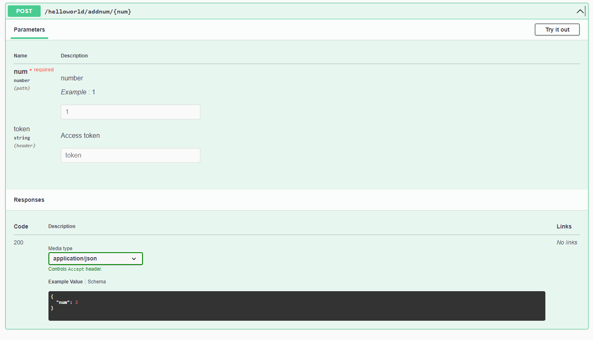

# 作業 - 2. swagger api 文件建立



## app.module.ts

```
@Module({
  imports: [HelloModule],
  controllers: [AppController],
  providers: [AppService],
})
```

## hello.module.ts

```
@Module({
  controllers: [HelloController],
  providers: [HelloService],
})
```

## hello.controller.ts

```
@Controller('helloworld')
export class HelloController {
  constructor(private readonly helloService: HelloService) {}
  @Get() sayHello(): string {
    return this.helloService.getHello();
  }
  @Post('addnum')
  @ApiTags('addnum')
  @ApiOkResponse({ type: OkResponse })
  addQuery(
    @Query() fromQuerys: FromQuerys,
    @Headers() fromHeaders: FromHeaders,
    @Body() fromBody: FromBody,
  ) {
    const bodyAdded = this.helloService.addNum(Number(fromQuerys.num));
    return bodyAdded;
  }
  @Post('addnum/:num')
  @ApiTags('addnum')
  @ApiOkResponse({ type: OkResponse })
  addParam(
    @Param() fromParams: FromParams,
    @Headers() fromHeaders: FromHeaders,
  ) {
    const paramAdded = this.helloService.addNum(Number(fromParams.num));
    return paramAdded;
  }
}
```

## dto.ts

okResponse 和 swagger api 抓的 template 要分開寫

```
import { ApiProperty } from '@nestjs/swagger';
export class FromBody {
  @ApiProperty({ description: 'number', example: 1, required: false })
  num: number;
}
export class FromHeaders {
  @ApiProperty({ description: 'Access token', required: false })
  token: string;
}
export class FromParams {
  @ApiProperty({ description: 'number', example: 1 })
  num: number;
}
export class FromQuerys {
  @ApiProperty({ description: 'number', example: 1 })
  num: number;
}
export class OkResponse {
  @ApiProperty({ example: 2 })
  num: number;
}
```
